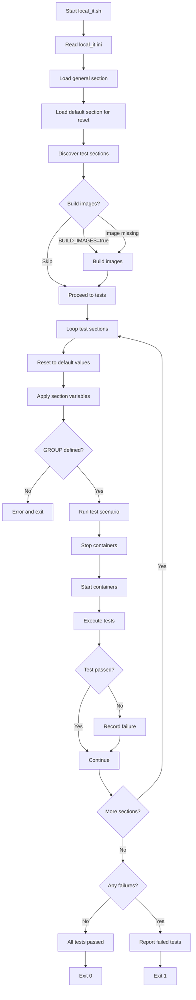

# Greengage PXF Integration Test Environment

This directory (`automation/env`) contains a set of scripts used to build and
run integration tests for Greengage PXF. These scripts are originally designed
to be executed by the GitHub CI workflow, but can also be run locally for
development and debugging purposes.

The main entry point for local execution is `local_it.sh`, which reads
configuration from a dedicated `.ini` file (`local_it.ini`).

---

## Purpose

The scripts in this directory provide an environment for automated integration
testing of PXF components under Docker. They reproduce the same sequence of
operations as performed by GitHub Actions CI, including image build,
environment setup, test execution, and artifact collection.

---

## Components Overview

### `build-images.sh`

Builds the Docker image `greengagedb/ggdb6_pxf_automation` used for
integration testing.

### `compose.sh`

Wrapper around Docker Compose. Manages start, stop, and status of the test
environment. Ensures required services are healthy before tests start.

### `it.sh`

Runs a specific integration test group with configurable parameters for FDW
and SSL modes.

### `local_it.sh`

**Main entry point for local execution**. Reads configuration from
`local_it.ini`, builds images if needed, runs all configured test scenarios
sequentially, and collects artifacts.

### `run_it.sh`

Legacy script preserved for compatibility with the previous CI system.
Not recommended for new use.

---

## Configuration-Based Test Management

### INI-Based Configuration System

The test execution uses a flexible INI-file configuration system
(`local_it.ini`) that allows defining multiple test scenarios with different
parameters.

#### Configuration Structure

```ini
[general]           ; Global settings (images, debug options)
[default]           ; Default values reset before each test scenario
[scenario_name]     ; Test scenario with description as section name
```

#### Key Concepts

- **Section names** serve as human-readable test descriptions
- **GROUP** variable defines the actual test group (smoke, gpdb, jdbc,
ggdbssl) - **MANDATORY** for each test section
- **PROFILE** specifies the test profile (defaults to 'all')
- **USE_FDW** and **USE_SSL** enable additional features
- Each scenario automatically resets to default values before execution
- Values in sections are executed as bash code (use with caution)

#### Example Configuration

```ini
[Smoke_External_Table]
GROUP=smoke
PROFILE=smoke

[GPDB_With_FDW]
GROUP=gpdb
PROFILE=gpdb
USE_FDW=true

[GGDB_With_FDW_SSL]
GROUP=ggdbssl
PROFILE=ggdbssl
USE_FDW=true
USE_SSL=true
```

---

## System Requirements

The scripts were developed and tested on **Ubuntu 24.04 LTS**. They may work
on other Linux distributions, but additional manual setup may be required.

### Required components

- **Docker** and **Docker Compose v2**
  - Must be available as `docker` and `docker compose`.
  - Can be installed using:

    ```bash
    curl -fsSL https://get.docker.com | sh
    ```

- **GNU Bash**
- **Coreutils** (standard on Linux)

### User permissions

- Scripts **must not be executed as root**. Strongly not recommended.
- The user running the scripts **must belong to the `docker` group** and be
  able to use Docker without `sudo`.

---

## Directory Structure

All scripts are located in `automation/env`. It is recommended to execute them
from this directory.

Test results, logs, and diffs are saved to `automation/env/artifacts/`

These artifacts are useful for incident analysis and debugging failed tests.

---

## Running Integration Tests Locally

### Quick start

From the `automation/env` directory:

```bash
bash local_it.sh
```

This will:

1. Read configuration from `local_it.ini`
2. Build the integration test image if not exists (or if BUILD_IMAGES=true)
3. Sequentially run all configured test scenarios
4. Collect and store artifacts under `automation/env/artifacts`

### Manual execution of specific scenarios

Each test scenario can be executed manually by setting environment variables:

```bash
GROUP=gpdb USE_FDW=true bash it.sh
```

### Environment Variables

| Variable    | Description                                      |
|-------------|--------------------------------------------------|
| `GROUP`     | Test group (smoke, gpdb, jdbc, ggdbssl)         |
| `USE_FDW`   | Enables FDW-based tests (any non-empty value)   |
| `USE_SSL`   | Enables SSL tests (any non-empty value)         |
| `PROFILE`   | Test profile (defaults to 'all')                |
| `DEBUG`     | Enables verbose output and additional logs      |
| `DEBUG_DIR` | Path for logs (default: `artifacts/docker_logs`)|

---

## Artifacts and Logs

After test execution, artifacts are stored under
`automation/env/artifacts/`, including:

- Test logs
- Docker container logs
- `.diffs` files from regression checks
- Allure test reports

These files are used to analyze test results and diagnose failures.

---

## How It Works

The scripts in `automation/env` serve as a wrapper around the PXF automation
tests located in `automation/`. They manage environment creation, Docker
container orchestration, and test execution, without implementing the tests
themselves.

When you run `local_it.sh`, the workflow proceeds as follows:



**Key Points:**

1. **Flexible Configuration**: Test scenarios defined in `local_it.ini`
2. **Automatic Reset**: Each scenario starts with clean defaults
3. **Mandatory GROUP**: Every test section must define GROUP variable
4. **Conditional Build**: Images built only when missing or forced
5. **Comprehensive Reporting**: Failed tests show scenario name and parameters

The PXF automation framework (`automation/`) contains TestNG-based tests for
PXF functionalities and exposes utility APIs for interacting with GGDB, HDFS,
Hive, HBase, and PXF services.

**Summary:**
This mechanism allows developers to run PXF integration tests locally in a
controlled and reproducible way, with flexible scenario configuration and
comprehensive artifact collection.

---

## Legacy Note

The script `run_it.sh` is retained for backward compatibility with the legacy
CI pipeline. All new development and debugging should use `local_it.sh`.
