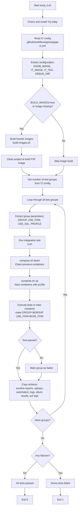

# Greengage PXF Integration Test Environment

This directory (`automation/env`) contains a set of scripts used to build and
run integration tests for Greengage PXF. These scripts are originally designed
to be executed by the GitHub CI workflow, but can also be run locally for
development and debugging purposes.

The main entry point for local execution is `local_it.sh`, which emulates the
CI integration testing process defined in
`.github/workflows/greengage-ci.yml`.

---

## Purpose

The scripts in this directory provide an environment for automated integration
testing of PXF components under Docker. They reproduce the same sequence of
operations as performed by GitHub Actions CI, including image build,
environment setup, test execution, and artifact collection.

---

## Components Overview

### `build-images.sh`

Builds the Docker image `greengagedb/ggdb6_pxf_automation` used for
integration testing. Used by both previous GitLab CI and local runs.

### `compose.sh`

Wrapper around Docker Compose. Manages start, stop, and status of the test
environment. Ensures required services are healthy before tests start.

### `it.sh`

Runs a specific integration test group (e.g. `smoke`, `gpdb`, `jdbc`,
`ggdbssl`) with optional parameters for FDW and SSL modes.

### `local_it.sh`

Main entry point for local execution. Emulates the CI workflow: builds
images, runs all test groups sequentially, and collects artifacts.

### `run_it.sh`

Legacy script preserved for compatibility with the previous (GitLab) CI system.
Not recommended for new use.

---

## System Requirements

The scripts were developed and tested on **Ubuntu 24.04 LTS**. They may work on
other Linux distributions, but additional manual setup may be required.

### Required components

- **Docker** and **Docker Compose v2**
  - Must be available as `docker` and `docker compose`.
  - Can be installed using:

    ```bash
    curl -fsSL https://get.docker.com | sh
    ```

- **YQ (v4.x)**
  - Required for reading test configuration from
    `.github/workflows/greengage-ci.yml`.
  - On Linux-like systems, YQ is installed automatically when missing.
  - On other systems, install manually following the instructions here:  
    [https://github.com/mikefarah/yq#install](https://github.com/mikefarah/yq#install)
  - Note: older 3.x versions (often installed via `apt`, `yum`, or `brew` on
    older systems) are not supported.
- **GNU Bash**
- **Coreutils** (standard on Linux)

### User permissions

- Scripts **must not be executed as root**. Strongly not recommended.
- The user running the scripts **must belong to the `docker` group** and be
  able to use Docker without `sudo`.

---

## Directory Structure

All scripts are located in `automation/env`. It is recommended to execute them
from this directory, even though `local_it.sh` attempts to support execution
from arbitrary paths.

Test results, logs, and diffs are saved to `automation/env/artifacts/`

These artifacts are useful for incident analysis and debugging failed tests.

---

## Running Integration Tests Locally

### Quick start

From the `automation/env` directory:

```bash
bash local_it.sh
```

This will:

1. Build the integration test image if not exists
   (`greengagedb/ggdb6_pxf_automation`).
2. Sequentially run all configured test groups (`smoke`, `gpdb`, `jdbc`,
   `ggdbssl`, etc.).
3. Collect and store artifacts under `automation/env/artifacts`.

### Manual execution

Each stage can be executed manually:

```bash
bash build-images.sh
bash compose.sh up
bash it.sh
bash compose.sh down
```

Optional environment variables (examples):

| Variable    | Description                                                |
|-------------|------------------------------------------------------------|
| `GROUP`     | Test group to execute (`smoke`, `gpdb`, `jdbc`, `ggdbssl`) |
| `USE_FDW`   | Enables FDW-based tests (`true` / unset)                   |
| `USE_SSL`   | Enables SSL tests (`true` / unset)                         |
| `PROFILE`   | Specifies test profile (usually same as `GROUP`)           |
| `DEBUG`     | Enables verbose output and additional logs                 |
| `DEBUG_DIR` | Path to store collected logs (default: `artifacts/docker_logs`) |

Example:

```bash
GROUP=gpdb USE_FDW=true bash it.sh
```

---

## Configuration Source

All test configurations, groups, and image definitions are derived from:

```text
.github/workflows/greengage-ci.yml
```

This file defines the canonical CI configuration. `local_it.sh` reads it
directly to replicate the same setup locally. To modify test sets or
configurations, edit the CI file - not the local scripts.

---

## Artifacts and Logs

After test execution, artifacts are stored under
`automation/env/artifacts/`, including:

- Test logs
- Docker container logs
- `.diffs` files from regression checks

These files are used to analyze test results and diagnose failures.

---

## How It Works

The scripts in `automation/env` serve as a wrapper around the PXF automation
tests located in `automation/`. They manage environment creation, Docker
container orchestration, and test execution, without implementing the tests
themselves.

The PXF automation framework (`automation/`) contains TestNG-based tests for
PXF functionalities and exposes utility APIs for interacting with GGDB, HDFS,
Hive, HBase, and PXF services. It requires a running Hadoop cluster, GGDB, and
JRE 1.8.

When you run `local_it.sh`, the workflow proceeds as follows:



**Key Points:**

1. The environment scripts do **not implement the tests** themselves - they
   prepare Docker containers, configure the environment, and call the actual
   PXF automation tests.
2. Test logic is implemented in `automation/` and uses:
   - TestNG via Maven
   - APIs for interacting with GGDB, PXF, HDFS, Hive, HBase
   - Utilities such as `pxf_regress` for query analysis, file comparison, and
     automation logging
3. `local_it.sh` ensures that the local execution mimics the CI workflow by
   reading `.github/workflows/greengage-ci.yml`.
4. Artifacts (logs, diffs, Allure results) are stored in
   `automation/env/artifacts` for post-run analysis.
5. If SSL or FDW is required, containers are restarted with the appropriate
   configuration (`docker-compose-ssl.yaml`).

**Summary:**
This mechanism allows a developer to run PXF integration tests locally in a
controlled and reproducible way, following the same sequence as CI, while
keeping the actual test logic in the main `automation` framework.

---

## Legacy Note

The script `run_it.sh` is retained for backward compatibility with the legacy
GitLab-based CI pipeline. All new development and debugging should use
`local_it.sh`. See [README_run_it.md](automation/env/README_run_it.md).
